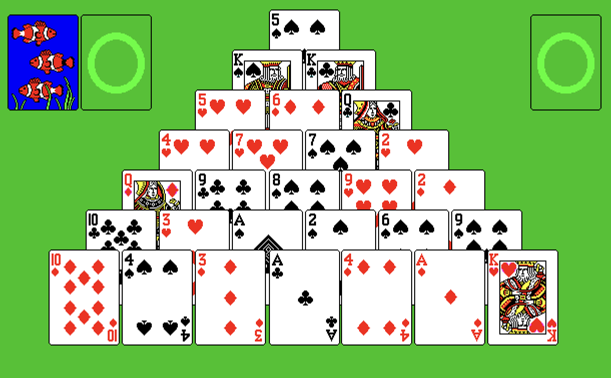

# Pyramid

Web-based version of solitaire variation [Pyramid](https://en.wikipedia.org/wiki/Pyramid_(solitaire)).

The rules are as follows:

1. There are seven rows of cards, with the first row containing a single card, and the seventh containing seven (in a triangular shape).
2. The rest of the cards are put in the talon.
3. The goal of the game is to move cards in the pyramid to a single foundation -- this is done by selecting two cards that have a total value of 13. Jacks, queens and kings are worth 11, 12, and 13 respectively. Therefore a King can be moved on its own.
4. Clicking the talon will turn over three cards into the waste. These can then be used to match against other playable cards in the pyramid. Only cards that have no others in front of them may be selected. One variation of this rule is that if a card is covered by only one other card, the card behind can be used to match to 13.
5. Three card draw allows the player to cycle through the talon as many times as they wish. Single card draw only allows the talon to be cycled through once.

